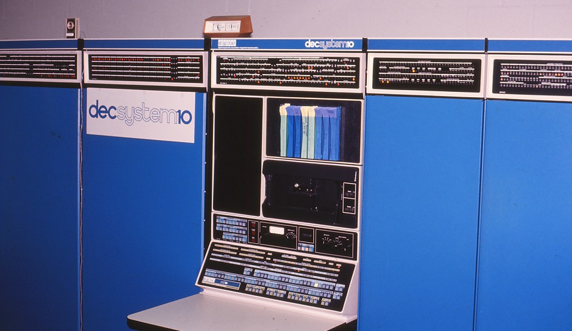

# DECsystem-10 (PDP-10 KI10) Emulator in Javascript 


This repository contains code to emulate a DECsystem-10 (PDP-10 KI10) computer originally manufactured by Digital Equipment Corporation (DEC).

The code normally resides at: [https://skn.noip.me/pdp10/pdp10.html](https://skn.noip.me/pdp10/pdp10.html)


## DECsystem-10 (PDP-10 KI10) Emulator

This emulator follows from earlier work on a [PDP-11 emulator](https://skn.noip.me/pdp11/) and was written after prompting by various people.

For several years I was a system programmer for the KI10 at La Trobe University in Melbourne Australia. I did get to play with the console panel a couple of times but normally the system was under the control of dedicated operating staff - we weren't supposed to touch. This PDP-10 had its own dedicated computer room and provided computing for the Research, Teaching and the Administrative needs of the University. The user base was rather diverse with everyone using RUNOFF to prepare documents, researchers writing programs in FORTRAN, LISP or PROLOG or using statistical packages like SPSS. Administrative programmers produced COBOL applications for payroll, finance and student records, and students seem to dable with everything.

My main memory from back then was the lack of recovery in any of the editors, combined with the frequency of reboots caused by system faults or power failures. It became a common thing to remind yourself or others to save the current document. Even though that sounds bad I remember sometimes looking forward to making improvements in the code or document as I typed it in the next time.

Eventually the KI10 was replaced by several VAXes. These were faster, cheaper and more reliable. However they didn't initially have the software maturity of the KI10 and never really provided environments such as LISP and PROLOG the way the PDP-10 did. It was a very sad day when all of the cabinets of the PDP-10 were craned onto a truck and taken away for scrap.

Writing an emulator for a 36-bit computer in Javascript has special challenges because Javascript provides only 32-bit bit operations. In addition some operands on a KI10 may be up to 71 bits long. As a result bit testing and manipulation must be done with the help of other operators such as division and modulo, and some operands must be split into multiple parts. I hate to think what this does for performance. However if you do encounter performance issues then just upgrade your PC. They are significantly faster and cheaper than a real DECsystem-10, and just imagine the savings in power consumption!

Happy emulating

Paul Nankervis


## Disk Images

This emulator currently has only one operating system configured which uses four RP03 disks to run TOPS-10 v6.03A. The version was chosen to match the TOPS-10 I used at La Trobe University. The login password for account 1,2 is 'FAILSA'.

This configuration was built from software and automated scripts provided by Richard Cornwell at [http://www.sky-visions.com/dec/](http://www.sky-visions.com/dec/), which is an excellent source of PDP-10 software and materials. My other major source for PDP-10 materials was [http://pdp-10.trailing-edge.com/](http://pdp-10.trailing-edge.com/)


### Example Boot log


```
Paul Nankervis - paulnank@hotmail.com

Boot> boot dpa0
Press RETURN to continue loading BOOTS...

<CR>

KI603 04-21-78
WHY RELOAD: sched
DATE: 13-dec-78
TIME: 1121

STARTUP OPTION: quick

%CONTROLLER RPA IS OFF-LINE

%CONTROLLER RPB IS OFF-LINE

%CONTROLLER DPB IS OFF-LINE

KI603 11:21:06 CTY system 514

.LOGIN 1,2
JOB 1 KI603 CTY
Password: failsa
1121    13-Dec-78       Wed

.TTY LC WIDTH 132

.dir

BACKUP  EXE   103  <057>   21-Apr-78    2(216)  DSKB:   [1,2]
OPR     BAK     3  <057>   21-Apr-78
JOBDAT  REL     1  <057>   21-Apr-78
OPR     ATO     3  <057>   21-Apr-78
SYSTEM  EXE   800  <057>   21-Apr-78    603A(20116)
  Total of 910 blocks in 5 files on DSKB: [1,2]

.systat

Status of KI603 at 11:25:28 on 13-Dec-78

Uptime 4:22, 98%Null time = 98%Idle + 0%Lost
1 Jobs in use out of 64.  1 logged in, 0 detached out of 64.  (LOGMAX)

Job    Who     Line#    What   Size(P)  State   Run Time

 1    [OPR]     CTY     SYSTAT  14+SPY  RN             3

Swapping space used = 0/1024 = 0%
Virt. Core used = 14/1024 = 1%
8002P Core left
Active swapping ratio = 14/8016 = 0.0
Average job size =14/1 = 14.0P+0/1 = 0.0P  Total=14/1 = 14.0P

No busy devices
1 disk DDBs

System File Structures:
Name    Free    Mount
DSKB    137857  2
Total Free 137857

HAPPY BIRTHDAY BILL HARDY

.
```

## DECsystem-10 (KI10) at La Trobe University circa 1981

